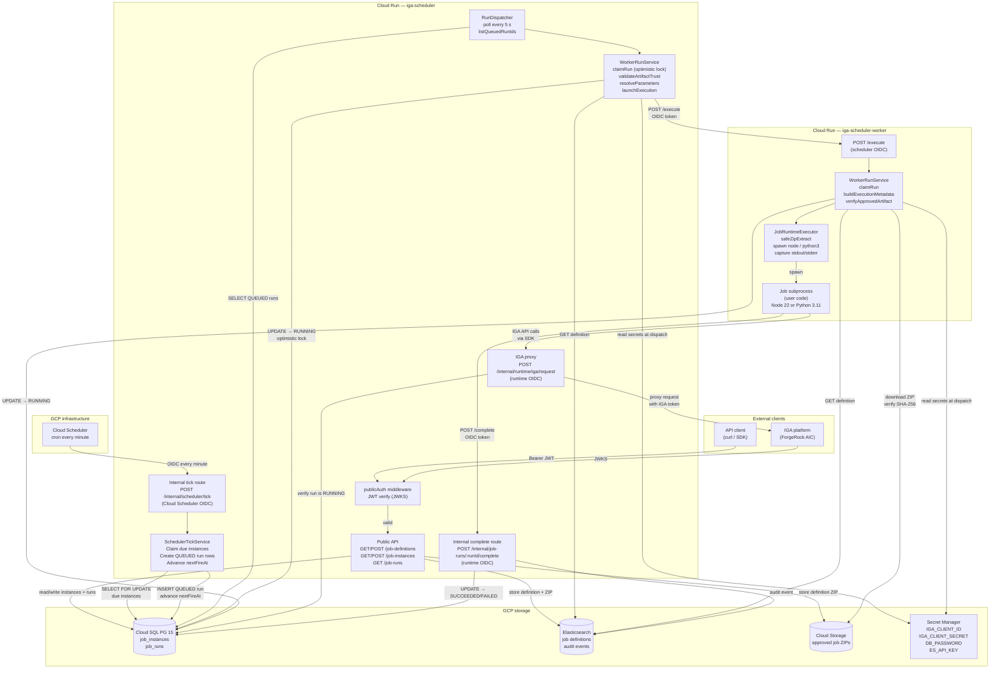
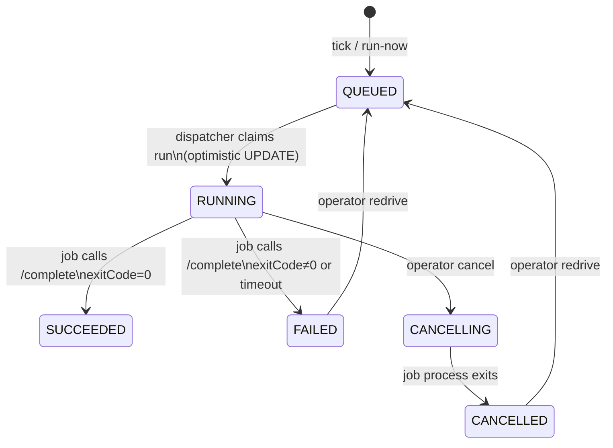
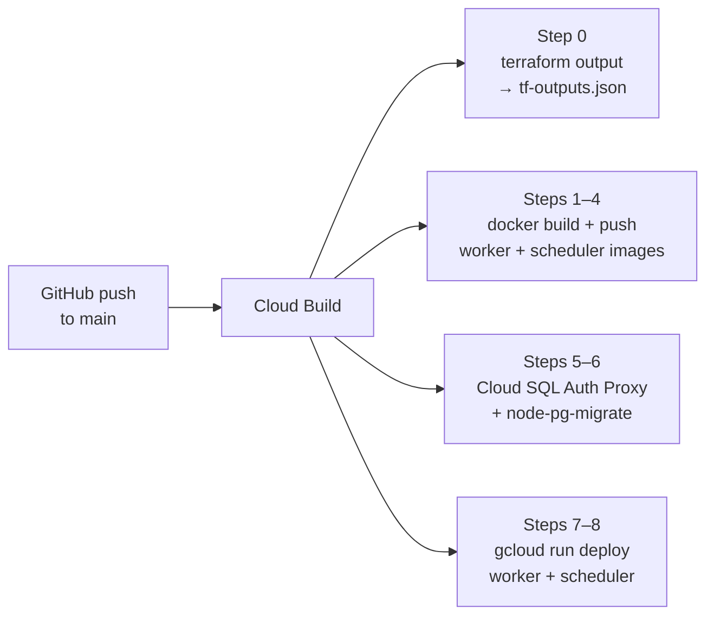

# Architecture

## System overview

## Data stores

| Store | Contents | Technology |
|---|---|---|
| Cloud SQL (PG 15) | `job_instances`, `job_runs` — schedule state and run queue | Cloud SQL |
| Elasticsearch | `scheduler_definitions_v1`, `scheduler_audit_v1` | Elastic Cloud |
| Cloud Storage | Approved job ZIP artifacts (`approved/<id>/<sha256>/job.zip`) | GCS |
| Secret Manager | `IGA_CLIENT_ID`, `IGA_CLIENT_SECRET`, `DB_PASSWORD`, `ES_API_KEY` | GCP Secret Manager |

## Run state machine

## Request flows

### Tick → dispatch

1. Cloud Scheduler fires `POST /internal/scheduler/tick` every minute (OIDC-authenticated).
2. `SchedulerTickService` opens a Postgres transaction, selects all instances where `next_fire_at ≤ now` with `SELECT FOR UPDATE SKIP LOCKED`, inserts a `QUEUED` run row for each, advances `next_fire_at`, and commits.
3. `RunDispatcher` (running in the scheduler process) polls `job_runs` for `QUEUED` rows every 5 seconds.
4. `WorkerRunService` claims each run with an optimistic `UPDATE … WHERE state = 'QUEUED'`, validates the artifact trust chain (APPROVED + CLEAN scan + SHA-256/generation match), resolves `sensitive` parameters from Secret Manager, then POSTs to the worker service's `/execute` endpoint with a GCP OIDC token.

### Worker execution

5. The worker service receives `POST /execute`, claims the run in Postgres, downloads the job ZIP from GCS, verifies SHA-256, extracts it, and spawns the entrypoint as a child process (`node` or `python3.11`).
6. The job subprocess can proxy calls to the IGA platform via `POST /internal/runtime/iga/request` — the scheduler verifies the calling run is RUNNING before forwarding.
7. On completion the subprocess (or the worker service on timeout) calls `POST /internal/job-runs/:runId/complete`. The scheduler updates the run to `SUCCEEDED` or `FAILED` and emits an audit event to Elasticsearch.

## CI/CD pipeline

